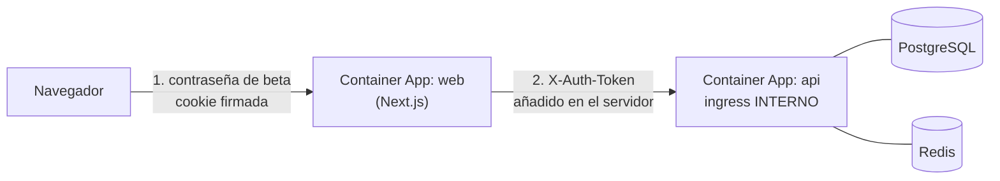

# Despliegue en Azure

Este directorio contiene la infraestructura **preparada, no desplegada**. Nada
se crea automáticamente: todos los comandos son manuales y algunos generan
recursos de pago.

## Por qué Bicep y no Terraform

Se ha elegido **Bicep**:

* El destino es exclusivamente Azure, así que la portabilidad de Terraform no
  aporta valor aquí.
* No hace falta gestionar un backend de estado remoto (Azure Resource Manager
  guarda el estado del despliegue).
* La CLI de Azure ya trae el compilador de Bicep, sin dependencias extra en CI.

Si en el futuro se añade otro proveedor de nube, migrar a Terraform sería lo
razonable.

## Recursos que crea

| Recurso | Servicio | Para qué |
| --- | --- | --- |
| `*-api` | Azure Container Apps | API FastAPI, con ingress público |
| `*-worker` | Azure Container Apps | Worker de análisis, sin ingress |
| `*-web` | Azure Container Apps | Frontend Next.js |
| `*-pg` | Azure Database for PostgreSQL Flexible Server | Base de datos con `pgvector` |
| `*-redis` | Azure Cache for Redis | Cola de trabajos |
| `*acr*` | Azure Container Registry | Imágenes de contenedor |
| `*kv*` | Azure Key Vault | Secretos |
| `*-logs` / `*-insights` | Log Analytics y Application Insights | Observabilidad |

## Requisitos previos

```bash
az --version          # Azure CLI 2.60 o superior
az login
az account set --subscription "<ID de tu suscripción>"
```

## 1. Crear el grupo de recursos

```bash
az group create \
  --name rg-creator-signal-dev \
  --location westeurope
```

## 2. Validar la plantilla (no crea nada)

```bash
az deployment group what-if \
  --resource-group rg-creator-signal-dev \
  --template-file infra/azure/main.bicep \
  --parameters @infra/azure/parameters.dev.json \
  --parameters postgresAdminPassword="$(openssl rand -base64 24)" \
  --parameters proxyAuthSecret="$(openssl rand -base64 36)" \
  --parameters betaAccessPassword="$(openssl rand -base64 18)" \
  --parameters betaSessionSecret="$(openssl rand -base64 36)" \
  --parameters authorHashSalt="$(openssl rand -base64 24)"
```

## 3. Desplegar

> Este paso **crea recursos de pago**.

```bash
PG_PASSWORD="$(openssl rand -base64 24)"
# Secreto compartido entre el frontend y la API. Guárdalo: sin él, el frontend
# no puede hablar con la API.
PROXY_SECRET="$(openssl rand -base64 36)"
BETA_PASSWORD="$(openssl rand -base64 18)"   # se la das a quien entre en la beta
BETA_SECRET="$(openssl rand -base64 36)"
AUTHOR_SALT="$(openssl rand -base64 24)"     # cambiarla invalida los hashes ya guardados

az deployment group create \
  --resource-group rg-creator-signal-dev \
  --template-file infra/azure/main.bicep \
  --parameters @infra/azure/parameters.dev.json \
  --parameters postgresAdminPassword="$PG_PASSWORD" \
  --parameters proxyAuthSecret="$PROXY_SECRET" \
  --parameters betaAccessPassword="$BETA_PASSWORD" \
  --parameters betaSessionSecret="$BETA_SECRET" \
  --parameters authorHashSalt="$AUTHOR_SALT" \
  --parameters youtubeApiKey="$YOUTUBE_API_KEY"
```

Guarda `PG_PASSWORD` y `PROXY_SECRET` en un gestor de secretos: la plantilla la escribe en Key
Vault, pero no se puede recuperar del despliegue.

## 4. Construir y publicar las imágenes

```bash
ACR=$(az deployment group show \
  --resource-group rg-creator-signal-dev \
  --name main \
  --query properties.outputs.containerRegistryLoginServer.value -o tsv)

az acr login --name "${ACR%%.*}"

docker build -f backend/Dockerfile -t "$ACR/creator-signal-backend:latest" .
docker build -f frontend/Dockerfile -t "$ACR/creator-signal-frontend:latest" ./frontend

docker push "$ACR/creator-signal-backend:latest"
docker push "$ACR/creator-signal-frontend:latest"
```

Vuelve a ejecutar el despliegue (paso 3) para que las Container Apps tomen las
imágenes nuevas, o actualiza sólo la revisión:

```bash
az containerapp update \
  --name creatorsignal-dev-api \
  --resource-group rg-creator-signal-dev \
  --image "$ACR/creator-signal-backend:latest"
```

## 5. Migraciones de base de datos

Las migraciones **no** se ejecutan solas en Azure. Lánzalas como un trabajo
puntual con la misma imagen del backend:

```bash
az containerapp job create \
  --name creatorsignal-dev-migrate \
  --resource-group rg-creator-signal-dev \
  --environment creatorsignal-dev-env \
  --trigger-type Manual \
  --replica-timeout 600 \
  --image "$ACR/creator-signal-backend:latest" \
  --command "alembic" "upgrade" "head" \
  --secrets "database-url=<valor de Key Vault>" \
  --env-vars "DATABASE_URL=secretref:database-url"

az containerapp job start \
  --name creatorsignal-dev-migrate \
  --resource-group rg-creator-signal-dev
```

Comprueba que `pgvector` está disponible antes de migrar:

```sql
SHOW azure.extensions;          -- debe incluir VECTOR
CREATE EXTENSION IF NOT EXISTS vector;
```

Si la extensión no estuviera disponible, la aplicación sigue funcionando: el
tipo `EmbeddingVector` degrada a JSONB automáticamente cuando
`PGVECTOR_MODE=auto`.

## Control de acceso: cómo está resuelto

Esta aplicación **no tiene usuarios propios**, y la API se niega a arrancar con
`APP_ENV=production` y `AUTH_MODE=none`. La plantilla no evita ese bloqueo
bajando a `development`: lo resuelve de verdad.

Hay **dos capas de acceso distintas**, y confundirlas fue el error de la
versión anterior: el secreto compartido autentica al *servicio*, nunca a la
*persona*.



1. **usuario → frontend**: contraseña de la beta y cookie de sesión firmada
   (`BETA_ACCESS_*`). Sin ella, un visitante no ve nada ni puede lanzar nada.
2. **frontend → API**: secreto de servicio (`TRUSTED_AUTH_VALUE`). Impide
   llamar a la API por otro camino.

* **La API no tiene ingress público** (`external: false`). Sólo la alcanza el
  frontend, desde dentro del entorno de Container Apps.
* El frontend lleva un **proxy de servidor** en `/api/*` que añade la cabecera
  compartida. El navegador nunca ve el secreto: las variables se llaman
  `API_INTERNAL_URL`, `TRUSTED_AUTH_HEADER` y `TRUSTED_AUTH_VALUE`, **sin**
  prefijo `NEXT_PUBLIC_`, que es lo que incrustaría el valor en el bundle.
* La API sólo acepta la cabecera si la petición llega desde
  `TRUSTED_PROXY_NETWORKS`.
* `proxyAuthSecret` es un parámetro `@secure()` **obligatorio y de al menos 32
  caracteres**: si falta, el despliegue falla antes de crear nada, en lugar de
  dejar una instalación que no arranca.

> **Precisión sobre dónde vive el secreto.** `proxyAuthSecret` se guarda como
> *secreto de Container Apps*, no en Key Vault. Es seguro —viaja como parámetro
> `@secure()` y no aparece en logs de despliegue—, pero no es lo mismo que Key
> Vault: no tiene rotación ni auditoría de acceso. Si necesitas eso, añade la
> referencia a Key Vault explícitamente.

Genera los secretos con:

```bash
openssl rand -base64 36   # proxyAuthSecret
openssl rand -base64 36   # betaSessionSecret
openssl rand -base64 24   # authorHashSalt
```

Si prefieres otra estrategia —Cloudflare Access, Azure Easy Auth, API
Management— la API la admite igual: lo único que necesita es que algo delante
autentique y añada la cabecera desde una red de confianza.

### Limitación conocida

Sin una red virtual propia, el rango de origen dentro del entorno de Container
Apps no es predecible, así que `trustedProxyNetworks` viene con los rangos
privados habituales. Para una beta con datos reales, despliega el entorno
**integrado en una VNet** y deja en ese parámetro únicamente el CIDR de su
subred: es lo que convierte la comprobación de red en una garantía y no en una
aproximación.

## Variables de entorno de producción

| Variable | Origen | Notas |
| --- | --- | --- |
| `DATABASE_URL` | Key Vault (`database-url`) | Incluye `sslmode=require` |
| `REDIS_URL` | Secreto de la Container App | Usa `rediss://` (TLS) |
| `YOUTUBE_API_KEY` | Key Vault (`youtube-api-key`) | Restringida por API en Google Cloud |
| `APP_ENV` | Literal | `production`: oculta los detalles técnicos de los errores |
| `CORS_ORIGINS` | Literal | URL exacta del frontend, nunca `*` |
| `ANTHROPIC_API_KEY` / `OPENAI_API_KEY` | Key Vault | Sólo si se activa la IA externa |
| `AUTHOR_HASH_SALT` | Key Vault | **Cámbiala**: la de ejemplo no es secreta |
| `OAUTH_TOKEN_ENCRYPTION_KEY` | Key Vault | Sólo si se activa el modo propietario |
| `AUTH_MODE` | Literal (`trusted_proxy`) | Sin esto la API no arranca en producción |
| `TRUSTED_AUTH_HEADER` | Parámetro | Cabecera que añade el frontend |
| `TRUSTED_AUTH_VALUE` | Secreto (`proxy-auth-secret`) | Compartido entre frontend y API. **Nunca** con prefijo `NEXT_PUBLIC_` |
| `TRUSTED_PROXY_NETWORKS` | Parámetro | Redes desde las que se acepta la cabecera |
| `BETA_ACCESS_ENABLED` | Literal (`true`) | Puerta de acceso de visitantes |
| `BETA_ACCESS_PASSWORD` | Secreto (`beta-access-password`) | Contraseña de la beta |
| `BETA_SESSION_SECRET` | Secreto (`beta-session-secret`) | Firma de la cookie de sesión |
| `AUTHOR_HASH_SALT` | Secreto (`author-hash-salt`) | Obligatorio: el valor de ejemplo no es secreto |
| `FRONTEND_URL` | Derivado | URL pública del frontend |
| `COMMENT_RETENTION_DAYS` | Literal | Retención de los comentarios brutos (por defecto 180) |

## Escalado de la API: una sola réplica

`maxReplicas: 1` en la API es deliberado. El límite de peticiones se guarda en
la memoria del proceso, así que con tres réplicas el tope efectivo sería el
triple y se reiniciaría cada vez que Container Apps moviera el tráfico. Es
preferible un límite pequeño y real que uno grande e imaginario.

Para subir de una réplica hay que mover antes el rate limit a Redis. El worker
sí escala: procesa de una cola compartida.

### Modo propietario en Azure

Viene **apagado** (`ENABLE_OWNER_MODE=false`) y la plantilla no crea sus
secretos. Para activarlo hacen falta, además de lo anterior:

* `GOOGLE_OAUTH_CLIENT_ID` y `GOOGLE_OAUTH_CLIENT_SECRET` como secretos;
* `OAUTH_TOKEN_ENCRYPTION_KEY` (`python -m app.cli generar-clave`);
* `GOOGLE_OAUTH_REDIRECT_URI` apuntando a
  `https://<frontend>/api/oauth/google/callback`, y esa misma URI autorizada en
  Google Cloud Console.

`FRONTEND_URL` ya lo fija la plantilla a la URL pública del frontend, que es a
donde vuelve el creador tras autorizar.

## Escalado del worker

* `minReplicas: 1` es obligatorio. Si el worker escala a cero, los análisis
  encolados se quedan sin procesar hasta que arranque una réplica.
* Cada réplica procesa un trabajo a la vez. Para más concurrencia, sube
  `maxReplicas`: RQ reparte los trabajos entre todas.
* El worker necesita más memoria que la API (2 GiB) porque carga los modelos de
  análisis. Si activas el extra `ml` (sentence-transformers), sube a 4 GiB.

## Qué encarece la factura

Ordenado por impacto típico:

1. **PostgreSQL Flexible Server**: es el recurso que está siempre encendido.
   `Standard_B1ms` basta para desarrollo.
2. **Worker de Container Apps**: al no poder escalar a cero, siempre hay una
   réplica facturando CPU y memoria.
3. **Azure Cache for Redis**: el nivel `Basic C0` es suficiente para la cola.
4. **API y frontend**: escalan a cero en desarrollo, así que su coste es
   proporcional al uso.
5. **Log Analytics**: se factura por GB ingerido. Con `LOG_LEVEL=INFO` el
   volumen es bajo; evita `DEBUG` en producción.
6. **Proveedor de IA externo**: no es un recurso de Azure, pero si activas
   `AI_PROVIDER`, cada análisis hace varias llamadas al modelo.

## Eliminar todos los recursos

```bash
az group delete --name rg-creator-signal-dev --yes --no-wait
```

Key Vault tiene borrado suave activado. Para liberar el nombre del todo:

```bash
az keyvault purge --name <nombre del key vault> --location westeurope
```

## Lista de comprobación antes de producción

- [ ] `APP_ENV=production` (oculta los detalles técnicos y desactiva `/docs`, `/redoc` y `/openapi.json`).
- [ ] `proxyAuthSecret` generado aleatoriamente (mínimo 32 caracteres) y guardado como secreto.
- [ ] La API tiene `external: false`: comprobado que su FQDN no responde desde fuera.
- [ ] `trustedProxyNetworks` acotado al CIDR real de la subred, con el entorno integrado en una VNet.
- [ ] Verificado que el bundle del navegador no contiene el secreto (`grep` sobre `.next/static`).
- [ ] `ENABLE_OWNER_MODE=false`, o con `AUTH_MODE=trusted_proxy`: con `none` la API no arranca.
- [ ] `CORS_ORIGINS` apunta sólo al dominio del frontend.
- [ ] `authorHashSalt` generada aleatoriamente. La plantilla la exige: el valor de ejemplo ya no es posible.
- [ ] `betaAccessPassword` y `betaSessionSecret` generados y compartidos sólo con quien deba entrar.
- [ ] Comprobado que un visitante sin contraseña no puede usar la aplicación ni sus rutas `/api/*`.
- [ ] Una sola réplica de la API, o el rate limit movido a Redis (ver más abajo).
- [ ] La clave de la API de YouTube está restringida a la YouTube Data API v3 en la consola de Google Cloud.
- [ ] `POSTGRES_PASSWORD` generada aleatoriamente y sólo en Key Vault.
- [ ] Copias de seguridad de PostgreSQL con la retención adecuada.
- [ ] Alertas de Application Insights sobre errores 5xx y fallos del worker.
- [ ] Revisada la política de retención de datos (`DATA_RETENTION_DAYS`).
- [ ] `ENABLE_DEMO_MODE=false` si no quieres exponer los datos ficticios.
- [ ] Las migraciones se han aplicado antes de dirigir tráfico a la versión nueva.
